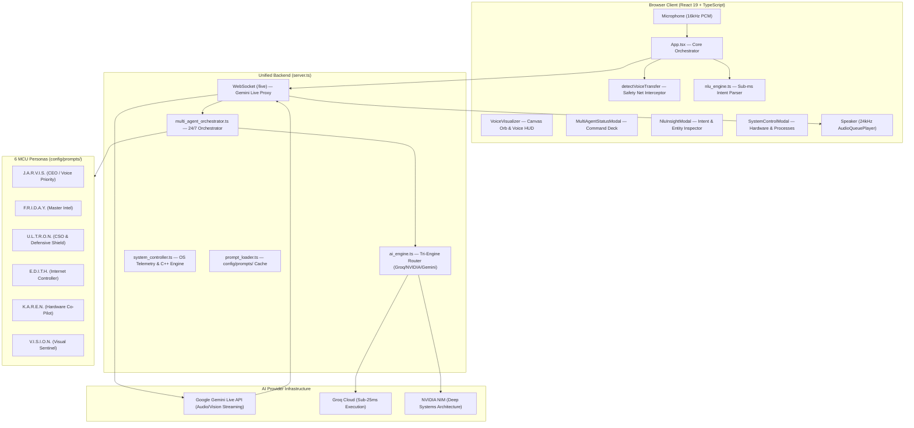

# 🧠 J.A.R.V.I.S. V0 — Master Architecture & Developer Guide

> **24/7 Autonomous Multi-Agent Voice Ecosystem & Operating System Orchestrator**  
> Powered by **Gemini Live Multimodal WebSockets**, **Groq Sub-25ms Tactical Engine**, **NVIDIA NIM Deep Systems Engine**, **Native C++ Workers**, and **Multi-Agent Voice Transfer Protocol**.

---

## 📑 Table of Contents

1. [Architecture Overview](#-architecture-overview)
2. [Multi-Agent Voice Transfer Protocol](#-multi-agent-voice-transfer-protocol)
3. [Persona Hierarchy & Domain Specifications](#-persona-hierarchy--domain-specifications)
4. [Muted Relay & Voice Patch-Through Protocols](#-muted-relay--voice-patch-through-protocols)
5. [Natural Language Understanding (NLU) Engine](#-natural-language-understanding-nlu-engine)
6. [Hands-Free Voice Vision & Screen Sharing](#-hands-free-voice-vision--screen-sharing)
7. [Native C++ Hardware & Telemetry Engine](#-native-c-hardware--telemetry-engine)
8. [Google Workspace Hub](#-google-workspace-hub)
9. [24/7 Ubuntu Systemd Daemon Configuration](#-247-ubuntu-systemd-daemon-configuration)
10. [REST & WebSocket API Reference](#-rest--websocket-api-reference)
11. [Build, Test & Deployment](#-build-test--deployment)

---

## 🌟 Architecture Overview



---

## 🎙️ Multi-Agent Voice Transfer Protocol

The Multi-Agent Voice Transfer Protocol enables seamless, on-the-fly persona transfers between co-pilots during active conversational sessions.

### 1. The 4-Pillar Pipeline

1. **System Meta-Prompting (`VOICE_TRANSFER_SYSTEM_INSTRUCTION`)**:
   - Injected into every agent's session so all personas recognize team members and their capabilities.
   - Enforces the **CEO Override**: J.A.R.V.I.S. is instructed to handle all tasks directly and *only* trigger a transfer when the user explicitly requests to switch.

2. **Function Calling (`switch_persona`)**:
   - Declared in `WORKSPACE_FUNCTION_DECLARATIONS` with parameter `targetPersonaId` (`'jarvis' | 'friday' | 'ultron' | 'edith' | 'karen' | 'vision'`).
   - When Gemini Live decides to transfer, it calls `switch_persona`. The server resolves the tool call immediately and notifies the client via `{ type: 'switch_persona_tool_call', targetPersonaId }`.

3. **Graceful Session Re-Initialization (`type: 'reinit'`)**:
   - The client sends `reinit` with the new agent's `voiceName` and `systemInstruction`.
   - The server re-establishes the Gemini Live connection with the new voice timbre without closing the user's browser WebSocket.

4. **Context Wake Prompt Injection**:
   - The client pushes a silent wake-up directive:
     ```text
     [VOICE_TRANSFER_PROTOCOL_ACTIVE]: Voice transfer complete. You are now active as {NAME} with voice ID '{VOICE}'. Greet the user immediately in character.
     ```
   - The new agent speaks immediately to introduce themselves in character.

### 2. Client-Side Safety Net Interceptor (`detectVoiceTransfer`)
If the user speaks rapidly (e.g., *"Switch to Ultron"*, *"Talk to Friday"*), the client parses incoming speech tokens via phonetic regex matchers (`ulton`, `ultrason`, `altron`, `friday`, `edith`, `karen`, `vision`). If detected, the client intercepts the handoff immediately to guarantee sub-100ms transfer latency.

---

## 👥 Persona Hierarchy & Domain Specifications

All prompts are modularly cached in `config/prompts/` and loaded dynamically via `prompt_loader.ts`:

| Persona | Role | Voice ID | Domain & Specialty | Prompt File |
|:---|:---|:---|:---|:---|
| **J.A.R.V.I.S.** | **CEO & Prime Orchestrator** | `Puck` | Global intent routing, dialogue state, manager delegation, voice priority. | `config/prompts/jarvis_prime.txt` |
| **F.R.I.D.A.Y.** | **Senior Analytics Manager** | `Kore` | Macro-knowledge, deep data synthesis, code refactoring, document drafting. | `config/prompts/friday_master.txt` |
| **U.L.T.R.O.N.** | **Chief Security Officer (CSO)** | `Charon` | Firewall rules, listening port audits, systemd health, exploit prevention. | `config/prompts/ultron_security.txt` |
| **E.D.I.T.H.** | **Tactical Recon Manager** | `Zephyr` | Web scraping, network telemetry, external APIs, perimeter diagnostics. | `config/prompts/edith_internet.txt` |
| **K.A.R.E.N.** | **Hardware & OS Co-Pilot** | `Aoede` | Screen backlight (Mutter D-Bus), PulseAudio volume, thermals, battery life. | `config/prompts/karen_tactical.txt` |
| **V.I.S.I.O.N.** | **Visual Sentinel** | `Fenrir` | Real-time screen analysis, camera visual reasoning, OCR, multimodal insight. | `config/prompts/vision_sentinel.txt` |

---

## 🔇 Muted Relay & Voice Patch-Through Protocols

```
┌────────────────────────────────────────────────────────────────────────────────────────┐
│                                   MUTED RELAY MODE                                     │
├────────────────────────────────────────────────────────────────────────────────────────┤
│ 1. Background Manager (e.g. U.L.T.R.O.N.) runs system task / security audit silently. │
│ 2. Manager outputs structured report: {ULTRON_SECURITY_STATUS: 0 failed services}.    │
│ 3. Server cleans brackets and relays summary to Prime J.A.R.V.I.S.                     │
│ 4. J.A.R.V.I.S. vocalizes the announcement to the user using his primary voice.        │
└────────────────────────────────────────────────────────────────────────────────────────┘
```

- **Voice Patch-Through**: Explicit voice command (*"Ultron take the mic"*) transfers audio focus directly to the manager.
- **24/7 Background Sentinel**: U.L.T.R.O.N. executes periodic vulnerability scans every 5 minutes in headless mode and pushes alerts over WebSocket.

---

## 🔍 Natural Language Understanding (NLU) Engine

- **Sub-5ms Execution**: Operates via deterministic regex entity extractors and intent classifiers in `src/utils/nlu_engine.ts`.
- **Taxonomy**: `system_control`, `vision_control`, `application_control`, `workspace_action`, `information_query`, `question`.
- **Entity Extraction**: `PERSON`, `DATE`, `TIME`, `LOCATION`, `APP_NAME`, `DEVICE_TARGET`, `PERCENTAGE`, `NUMBER`, `FILE_PATH`.
- **Interactive Inspector**: Accessible via the **NLU** button in the top navigation bar or `POST /api/nlu/analyze`.

---

## 📹 Hands-Free Voice Vision & Screen Sharing

- **Voice Commands**:
  - *"Jarvis, share my screen"* ➔ `start_screen_sharing`
  - *"Turn on my camera"* ➔ `start_camera_vision`
  - *"Stop vision"* ➔ `stop_all_vision`
- **Server Push**: WebSocket message `{ type: 'vision_control', action: 'start_screen', mode: 'screen' }` automatically initiates media capture in `src/App.tsx`.

---

## ⚙️ Native C++ Hardware & Telemetry Engine

- **Mutter D-Bus Backlight Synchronization**: Invokes `org.gnome.Mutter.DisplayConfig.SetBacklight` via compiled C++ binary in `workers_cpp/bin/hardware_ctrl`, keeping GNOME Settings, Quick Settings slider, and Web UI synchronized.
- **PulseAudio / ALSA Volume Controller**: Real-time volume and mute control.
- **Event Bus**: Dispatches `jarvis-hardware-updated` custom DOM events to update all UI components instantly.

---

## 📂 Google Workspace Hub

Full OAuth2-integrated tool suite:
- **Google Calendar**: Create events, list meetings, inspect attendee lists.
- **Gmail**: Read unread threads, compose drafts, send messages.
- **Google Drive / Docs / Sheets / Tasks**: File search, doc editing, spreadsheet row appends, and task lists.

---

## 🛡️ 24/7 Ubuntu Systemd Daemon Configuration

Service file located at `config/jarvis.service`:

```ini
[Unit]
Description=J.A.R.V.I.S. 24/7 Master Multi-Agent Continuous Core
After=network.target sound.target
Wants=network-online.target

[Service]
Type=simple
User=gopi
WorkingDirectory=/home/gopi/Downloads/JARVIS-V0
EnvironmentFile=/home/gopi/Downloads/JARVIS-V0/.env
ExecStart=/usr/bin/npm start
Restart=always
RestartSec=3
StandardOutput=journal
StandardError=journal

[Install]
WantedBy=default.target
```

To enable and start the 24/7 background service:
```bash
sudo cp config/jarvis.service /etc/systemd/system/
sudo systemctl daemon-reload
sudo systemctl enable --now jarvis.service
```

---

## 🔌 REST & WebSocket API Reference

### Key Endpoints:
- `GET /api/orchestrator/status`: Returns ecosystem hierarchy, active persona, and muted relay events.
- `POST /api/orchestrator/swap-persona`: Hot-swaps active persona (`{ personaId: "ultron" }`).
- `POST /api/orchestrator/delegate`: Delegates a background task in Muted Relay mode (`{ task, managerId }`).
- `POST /api/nlu/analyze`: Real-time speech/text NLU intent & entity extraction (`{ text }`).
- `GET /api/system/hardware`: Telemetry for brightness, volume, battery, and power profiles.
- `POST /api/chat`: Multi-engine AI routing (Groq sub-25ms / NVIDIA NIM / Gemini fallback).

---

## 🔨 Build, Test & Deployment

```bash
# 1. Install dependencies
npm install

# 2. Build C++ Native Worker
make -C workers_cpp

# 3. Run Automated NLU Test Suite
npx tsx src/utils/nlu_engine.test.ts

# 4. Run Development Server
npm run dev

# 5. Production Build
npm run build

# 6. Start Production Server
npm start
```

---

*Authored by J.A.R.V.I.S. Multi-Agent Engineering Team — 2026*