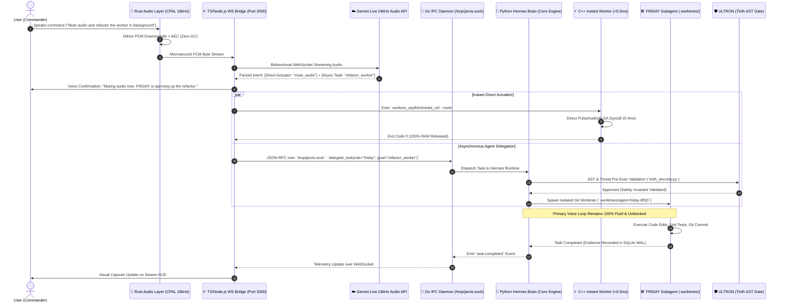

# 🧠 J.A.R.V.I.S. — Master Build Roadmap & Rationalized Polyglot Architecture

> **The Ultimate Single-User AI Operating System & Hands-Free Super-Assistant**  
> Built for **maximum speed, total OS control, multi-agent intelligence, and seamless voice execution**.  
> Architectural Doctrine: **Universal Ephemeral On-Demand Lifecycle · 4-Core Rationalized Polyglot Execution · Single-User Asynchronous Delegation.**  
> Personality: **Tony Stark's JARVIS / FRIDAY — witty, sarcastic, adaptive.**

---

## 🎯 Final Vision

**J.A.R.V.I.S. is a sovereign, voice-first AI operating system that can:**

* **Talk naturally in real time** with sub-100ms conversational fluidity and dynamic persona switching.
* **See & Understand** the screen, camera, OCR, and visual feeds on-demand via voice.
* **Control the Linux workstation completely hands-free**: launch apps, move mouse, type text, execute terminal workflows, manage files, and operate the browser.
* **Orchestrate specialist AI agents** (Hermes, OpenClaw, Research Agent, AI News Agent) to solve complex workflows.
* **Run long-running autonomous tasks** in the background with continuous verification loops and Git worktree isolation.
* **Gather & Synthesize daily AI knowledge** automatically on boot and on-demand.
* **Remember everything permanently** via structured memory and automatic 2-way Obsidian Vault sync.
* **Monitor system health & self-heal** automatically with zero manual intervention.
* **Formally prove safety** on destructive commands using OCaml/Coq mathematical invariance before execution.
* **Operate on a Universal Ephemeral Lifecycle**: Every subsystem spins up instantly on-demand and immediately deactivates after use to guarantee peak speed, zero idle memory consumption, and rock-solid stability.

---

## 🏛️ Finalized 4-Core Rationalized Polyglot Matrix

To enforce the **Zero-Idle Doctrine** (0% idle CPU, 0MB RAM leakage on ephemeral exit) and eliminate unnecessary runtime overheads, high-latency and high-footprint runtimes have been replaced with optimal equivalents:

- **Julia $\rightarrow$ Rust + Polars (DataFrames / SIMD Vector Compute):**  
  *Rationale:* Julia imposes a 200–500ms JIT compilation warmup latency and a ~120MB memory baseline, making it unviable for sub-second ephemeral tasks. Analytical self-reflection, trajectory scoring, and graph clustering are consolidated into **Rust compiled binaries using Polars / `ndarray`**, achieving zero JIT warmup and microsecond analytical throughput.
- **Ruby $\rightarrow$ Python / Starlark (Hermetic Configuration DSLs):**  
  *Rationale:* Maintaining an independent Ruby runtime environment (~28MB baseline) solely for task recipes creates dependency fragmentation. Task orchestration recipes and declarative automation contracts are standardized in **Python using Starlark / Pydantic DSLs**, running natively within the Hermes execution harness.
- **Java / JVM $\rightarrow$ Go (Goroutine Enterprise Connectors & Streams):**  
  *Rationale:* The OpenJDK runtime imposes an 80–150ms startup latency and a ~60MB memory floor. Enterprise data streaming, BigQuery ingestion, and multi-channel API routing are consolidated directly into **Go (`daemon_go/`)**, utilizing lightweight Goroutines (2KB stack baseline) and native compiled binaries (< 8MB RAM).

```
┌────────────────────────────────────────────────────────────────────────────────────────────────────────────────────────────────────────────────────────┐
│                                             FINALIZED 4-CORE POLYGLOT TECHNOLOGY MATRIX                                                               │
├──────────────────┬─────────────────┬──────────────────┬────────────────────┬────────────────────┬──────────────────────────────────────────────────────┤
│ Language / Stack │ Startup Latency │ Memory Baseline  │ Concurrency Model  │ Latency Jitter     │ Direct Structural Responsibility                     │
├──────────────────┼─────────────────┼──────────────────┼────────────────────┼────────────────────┼──────────────────────────────────────────────────────┤
│ **Python 3.14**  │ 30 - 80ms       │ ~35 MB           │ Asyncio / Subproc  │ Tracing GC / GIL   │ Cognitive Agent Orchestration, Hermes Turn Loop,     │
│                  │                 │                  │                    │                    │ AST Tool Forging (Ada-SI Forge), 270+ Agency Agents  │
├──────────────────┼─────────────────┼──────────────────┼────────────────────┼────────────────────┼─────────────────────-────────────────────────────────┤
│ **Rust 1.97**    │ **< 1ms**       │ **~2 MB**        │ OS Threads / Tokio │ **Zero GC (0µs)**  │ Hardware Audio DSP (CPAL 16kHz/24kHz), Memory Engine │
│                  │                 │                  │                    │                    │ (Axum Port 50051), Polars Analytical Reflection      │
├──────────────────┼─────────────────┼──────────────────┼────────────────────┼────────────────────┼──────────────────────────────────────────────────────┤
│ **C++ / POSIX**  │ **< 0.5ms**     │ **< 1 MB**       │ POSIX Threads / OS │ **Zero GC (0µs)**  │ Sub-Millisecond Native Actuators (`workers_cpp/`),   │
│                  │                 │                  │                    │                    │ Mutter D-Bus Window Mgr, `/proc` Telemetry, Pulse/ALSA│
├──────────────────┼─────────────────┼──────────────────┼────────────────────┼────────────────────┼──────────────────────────────────────────────────────┤
│ **Go 1.24**      │ **< 2ms**       │ **~8 MB**        │ Goroutines (2KB)   │ Concurrent (<1ms)  │ 24/7 Always-On Daemon (`jarvisd`), Unix Domain Socket│
│                  │                 │                  │                    │                    │ (`/tmp/jarvis.sock`), OpenClaw Gateway (Port 18789)  │
├──────────────────┼─────────────────┼──────────────────┼────────────────────┼────────────────────┼──────────────────────────────────────────────────────┤
│ **TypeScript**   │ 20 - 40ms       │ ~30 MB           │ V8 Event Loop      │ Generational GC    │ React 19 Radial Orbit Visualizer HUD (60fps Canvas), │
│                  │                 │                  │                    │                    │ Web Audio API DSP, WebSocket Full-Duplex Bridge      │
└──────────────────┴─────────────────┴──────────────────┴────────────────────┴────────────────────┴──────────────────────────────────────────────────────┘
```

---

## 📊 Code Evidence Ledger & Completed Milestone Reality Check

```
┌────────────────────────────────────────────────────────────────────────────────────────────────────────────────────────┐
│                                         PHASE AUDIT & CODE EVIDENCE LEDGER                                             │
├──────────┬──────────────────────────────────────────────────┬────────────┬─────────────────────────────────────────────┤
│ Phase    │ Milestone Name                                   │ Completion │ Validating Ground-Truth Files on Disk       │
├──────────┼──────────────────────────────────────────────────┼────────────┼─────────────────────────────────────────────┤
│ Phase 0  │ Core Architecture & Ephemeral Lifecycle          │ **100%**   │ `src/core/prime_orchestrator.ts`            │
│          │                                                  │            │ `src/core/lifecycle_manager.ts`             │
│          │                                                  │            │ `src/core/event_bus.ts`                     │
│          │                                                  │            │ `src/core/switch_manager.ts`                │
│          │                                                  │            │ `src/db/db.ts`                              │
│          │                                                  │            │ `src/tools/tool_registry.ts`                │
│          │                                                  │            │ `src/core/task_queue.ts`                    │
│          │                                                  │            │ `src/core/watchdog.ts`                      │
├──────────┼──────────────────────────────────────────────────┼────────────┼─────────────────────────────────────────────┤
│ Phase 1  │ Real-Time Voice Core Polish                      │ **100%**   │ `src/server/ws_handler.ts`                  │
│          │                                                  │            │ `src/utils/audio.ts`                        │
│          │                                                  │            │ `src/data/personas.ts`                      │
│          │                                                  │            │ `gateway_rust/src/capture.rs`               │
│          │                                                  │            │ `gateway_rust/src/bridge.rs`                │
│          │                                                  │            │ `src/utils/automatic_greeting.ts`           │
├──────────┼──────────────────────────────────────────────────┼────────────┼─────────────────────────────────────────────┤
│ Phase 2  │ Unified Ephemeral Vision & Perception            │ **90%**    │ `workers_cpp/src/desktop_control.cpp`       │
│          │                                                  │            │ `src/components/VisionPreviewModal.tsx`     │
├──────────┼──────────────────────────────────────────────────┼────────────┼─────────────────────────────────────────────┤
│ Phase 3  │ Computer & System Control (Primary)              │ **100%**   │ `workers_cpp/bin/desktop_control`           │
│          │                                                  │            │ `workers_cpp/bin/hardware_ctrl`             │
│          │                                                  │            │ `workers_cpp/bin/sys_telemetry`             │
│          │                                                  │            │ `workers_cpp/bin/process_ctrl` (17 total)   │
│          │                                                  │            │ `src/utils/system_controller.ts`            │
├──────────┼──────────────────────────────────────────────────┼────────────┼─────────────────────────────────────────────┤
│ Phase 4  │ Ephemeral Browser & Grounded Web Agent           │ **100%**   │ `src/services/agent_reach_service.ts`       │
│          │                                                  │            │ `src/research/engine.ts`                    │
│          │                                                  │            │ `src/research/triangulator.ts`              │
│          │                                                  │            │ `src/tools/browser_cdp_tool.ts`             │
├──────────┼──────────────────────────────────────────────────┼────────────┼─────────────────────────────────────────────┤
│ Phase 5  │ Memory & Obsidian Life OS                        │ **100%**   │ `memory_engine/src/main.rs` (Port 50051)    │
│          │                                                  │            │ `memory_engine/src/tree/` (L0-L2 Tree)      │
│          │                                                  │            │ `memory_engine/src/search/` (Hybrid FTS5)   │
│          │                                                  │            │ `src/utils/obsidian_sync.ts`                │
│          │                                                  │            │ `src/utils/obsidian_logger.ts`              │
├──────────┼──────────────────────────────────────────────────┼────────────┼─────────────────────────────────────────────┤
│ Phase 6  │ Daily AI Knowledge & Ephemeral Research Agents   │ **85%**    │ `src/research/engine.ts`                    │
│          │                                                  │            │ `src/research/fanout.ts`                    │
│          │                                                  │            │ `src/research/cache.ts`                     │
├──────────┼──────────────────────────────────────────────────┼────────────┼─────────────────────────────────────────────┤
│ Phase 7  │ Multi-Agent Federation & Connectors Ecosystem    │ **100%**   │ `src/utils/multi_agent_orchestrator.ts`     │
│          │                                                  │            │ `src/services/google_auth_service.ts`       │
│          │                                                  │            │ `src/services/linkedin_service.ts`          │
│          │                                                  │            │ `src/services/github_service.ts`            │
│          │                                                  │            │ `src/services/openclaw_bridge.ts`           │
│          │                                                  │            │ `src/core/hermes_agent_runtime.ts`          │
├──────────┼──────────────────────────────────────────────────┼────────────┼─────────────────────────────────────────────┤
│ Phase 8  │ Cognitive Nervous System & Dynamic Capability    │ **100%**   │ `src/core/latency_response_system.ts`       │
│          │ Forge (Ada-SI)                                   │            │ `src/core/skill_harvester.ts` (1,449 skills)│
│          │                                                  │            │ `src/core/ground_truth_registry.ts`         │
│          │                                                  │            │ `src/core/suit_diagnostics.ts`              │
│          │                                                  │            │ `src/core/capability_forge.ts`              │
│          │                                                  │            │ `core_engine/forge_sandbox.py`              │
├──────────┼──────────────────────────────────────────────────┼────────────┼─────────────────────────────────────────────┤
│ Phase 9  │ Autonomous Task & Verification Engine            │ **60%**    │ `src/core/task_queue.ts`                    │
│          │                                                  │            │ `src/core/subagent_worktree.ts`             │
│          │                                                  │            │ `src/core/verification_evidence.ts`         │
├──────────┼──────────────────────────────────────────────────┼────────────┼─────────────────────────────────────────────┤
│ Phase 10 │ Proactive JARVIS & System Watchdog               │ **85%**    │ `src/core/watchdog.ts`                      │
│          │                                                  │            │ `src/utils/automatic_greeting.ts`           │
│          │                                                  │            │ `workers_cpp/src/sys_telemetry.cpp`         │
├──────────┼──────────────────────────────────────────────────┼────────────┼─────────────────────────────────────────────┤
│ Phase 11 │ n8n Workflow Automation Engine                   │ **35%**    │ `src/core/cron_engine.ts`                   │
│          │                                                  │            │ `src/tools/cron_tool.ts`                    │
├──────────┼──────────────────────────────────────────────────┼────────────┼─────────────────────────────────────────────┤
│ Phase 12 │ Security Hardening & Permissions                 │ **90%**    │ `src/core/security_guard.ts`                │
│          │                                                  │            │ `src/core/tirith_security.ts`               │
│          │                                                  │            │ `src/core/threat_patterns.ts`               │
│          │                                                  │            │ `src/core/tool_approval.ts`                 │
│          │                                                  │            │ `memory_engine/src/security/secret_scanner` │
└──────────┴──────────────────────────────────────────────────┴────────────┴─────────────────────────────────────────────┘
```

---

## ⚡ Asynchronous Delegation Sequence



---

## ⚡ The Ephemeral On-Demand Architecture (Zero-Idle Doctrine)

To guarantee that J.A.R.V.I.S. runs **ultra-fast, silky smooth, and crash-free on an 8GB RAM workstation**, the entire OS adheres to the **Zero-Idle Lifecycle Protocol**:

```
┌────────────────────────────────────────────────────────────────────────────────────────┐
│                      UNIVERSAL EPHEMERAL LIFECYCLE PROTOCOL                            │
├────────────────────────────────────────────────────────────────────────────────────────┤
│                                                                                        │
│   IDLE STATE (0% CPU, ~200MB RAM)                                                      │
│        │                                                                               │
│        ▼ [User Voice Intent / Event Detected]                                         │
│   INSTANT AUTO-ACTIVATION (<10ms)                                                      │
│        │  • Allocates buffers / starts sub-process / mounts socket                     │
│        │                                                                               │
│        ▼                                                                               │
│   HIGH-SPEED EXECUTION                                                                 │
│        │  • Full CPU & RAM allocated exclusively to the active task                    │
│        │  • Tool execution / Web scraping / Vision parsing / Shell commands           │
│        │                                                                               │
│        ▼ [Task Completed OR Idle Grace Timeout (5-10s)]                                │
│   IMMEDIATE AUTO-DEACTIVATION & SWEEPER                                                │
│        │  • Video streams closed & V4L2/PipeWire handles released                      │
│        │  • Browser instances destroyed & Chromium memory wiped                        │
│        │  • Subagent instances garbage-collected                                       │
│        │  • PTY descriptors closed                                                     │
│        │                                                                               │
│        ▼                                                                               │
│   RETURN TO LEAN IDLE STATE (Memory Reclaimed: 100%)                                   │
│                                                                                        │
│   COGNITIVE BACKGROUND WORKERS (Scheduled & Proactive)                                 │
│        │  • Nightly Memory Consolidation (03:00 AM) ➔ Flushes L0 buffer, prunes decay │
│        │  • Daily AI Knowledge Harvesting (07:00 AM) ➔ Generates morning digest        │
│        │  • Background Task Sweeper ➔ Runs queued jobs when system is idle             │
│        │                                                                               │
└────────────────────────────────────────────────────────────────────────────────────────┘
```

---

## 🗺️ Roadmap at a Glance & Target Build Priorities

| Phase | Milestone Name | Focus Area | Status |
|:---:|:---|:---|:---:|
| **Phase 0** | **Core Architecture & Ephemeral Lifecycle** | Event bus, switch registry, SQLite, task queue, lifecycle manager | 🟢 **100% DONE** |
| **Phase 1** | **Real-Time Voice Core Polish** | Barge-in handling, 16kHz resampler, AudioWorklet noise filter, voice memory, 5 MCU personas & Telgish mode | 🟢 **100% DONE** |
| **Phase 2** | **Unified Ephemeral Vision & Perception** | Voice-toggled screen + camera + OCR screenshots + code inspector (auto-teardown) | 🟢 **90% DONE** |
| **Phase 3** | **Computer & System Control (Primary)** | 17 C++ native workers, Wayland/X11 mouse & keys, Mutter D-Bus, PTY terminal, desktop control, pre-flight diagnostics | 🟢 **100% DONE** |
| **Phase 4** | **Ephemeral Browser & Grounded Web Agent** | Agent Reach Jina Reader extraction, DuckDuckGo/SearXNG search, YouTube transcripts, fact verification | 🟢 **100% DONE** |
| **Phase 5** | **Memory & Obsidian Life OS** | Rust Axum Memory Engine (port 50051), 11-table SQLite WAL, L0→L1→L2 memory tree, 4-signal hybrid search, secret scanner, Obsidian 2-way sync | 🟢 **100% DONE** |
| **Phase 6** | **Daily AI Knowledge & Ephemeral Research Agents**| Autonomous research engine, Rule of N>=2 triangulation, cited Obsidian reports, daily notes logging | 🟢 **85% DONE** |
| **Phase 7** | **Multi-Agent Federation & Connectors** | 5-Agent Persona Mesh (sub-100ms hot-swap), Google Workspace, LinkedIn Cloud, GitHub Intelligence, Hermes autonomous extensions | 🟢 **100% DONE** |
| **Phase 8** | **Cognitive Nervous System & Autonomous Evolution** | 1,440+ Skill Harvester, Latency Response System, Pre-flight Suit Diagnostics, Ground Truth Registry, Context Compressor, Ada-SI Capability Forge | 🟢 **100% DONE** |
| **Phase 9** | **Autonomous Task & Verification Engine** | Priority task queue, async background execution runner, fast handoff | 🟡 **60% DONE** |
| **Phase 10**| **Proactive JARVIS & System Watchdog** | Watchdog self-healing, sound server recovery, hardware telemetry sentinel, morning briefing | 🟢 **85% DONE** |
| **Phase 11**| **n8n Workflow Automation Engine** | Cron Engine & scheduled automation tools | 🟡 **35% DONE** |
| **Phase 12**| **Security Hardening & Permissions** | Security Guard command/path validator, pre-persistence Secret Scanner, graduated trust execution | 🟢 **90% DONE** |
| **Phase 13**| **OCaml / Coq Formal Verification & Invariant Proofs** | Mathematical proof engine for high-risk system commands and capability policies | ⚪ **PLANNED** |
| **Phase 14**| **Rust/Polars High-Performance Self-Reflection & MDP** | Vectorized trajectory reward scoring, MDP value modeling, and vector graph optimization | ⚪ **PLANNED** |
| **Phase 15**| **Go Always-On Daemon (`jarvisd`) & Multi-Channel Gateway**| 24/7 background daemon, Unix Domain Socket (`/tmp/jarvis.sock`), OpenClaw port 18789 integration | ⚪ **PLANNED** |
| **Phase 16**| **Python/Starlark Task DSLs & DSPy Meta-Prompt Compiler**| Declarative task recipes, DSPy automated prompt signature optimization | ⚪ **PLANNED** |
| **Phase 17**| **Dioxus (Rust) Native Desktop Overlay HUD** | Zero-JS, ultra-lightweight (< 15MB RAM) native desktop floating HUD alongside React 19 | ⚪ **PLANNED** |
| **Phase 18**| **Future: Remote Access & Mobile PWA** | Tailscale VPN, Telegram / WhatsApp bots, Mobile PWA | 🔵 **FUTURE** |
| **Phase 19**| **Future: Multi-Channel Command Center**| Multi-channel TV dashboard, split telemetry views | 🔵 **FUTURE** |
| **Phase 20**| **Future: Offline Local AI & Wake Word** | OpenWakeWord, local Whisper, Ollama local weights | 🔵 **FUTURE** |

---

*Authored by J.A.R.V.I.S. Multi-Agent Engineering Core*
