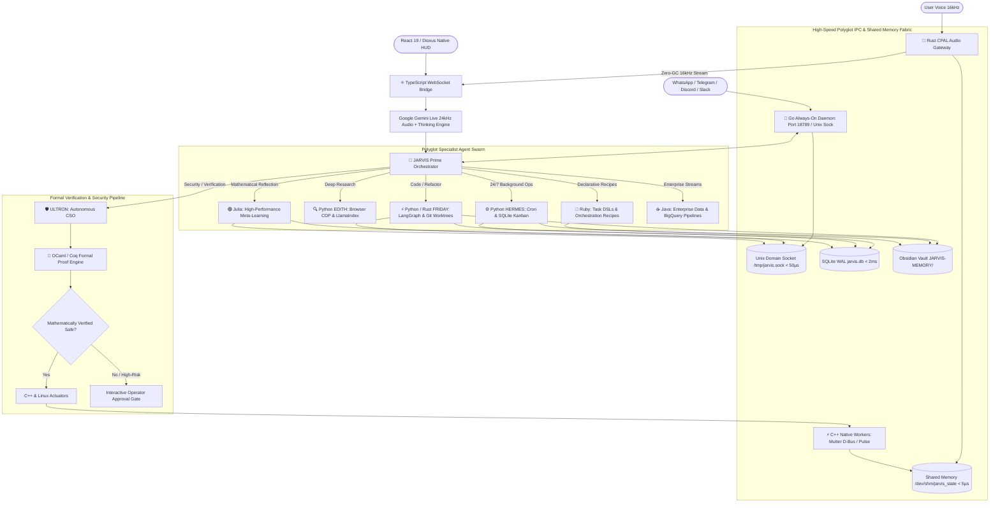

# 🌌 J.A.R.V.I.S. Sovereign Polyglot Multi-Agent Operating System (OS)
## Master Architecture Report, Technology Evaluation & Build Blueprint

> **Document Classification:** Master System Specification & Build Plan  
> **Core Repositories & Harnesses:**  
> - **JARVIS-V0 Base:** `/home/gopi/Downloads/JARVIS-V0` (Voice-first 24kHz DSP, C++ workers, React 19 Radial Orbit HUD)  
> - **Hermes Agent & Harness:** `/home/gopi/.hermes/hermes-agent` (Autonomous conversation loop, Tirith security, Git worktrees, learning graph, kanban)  
> - **OpenClaw Gateway & OS:** `/home/gopi/.openclaw` & `/home/gopi/.nvm/versions/node/v24.19.0/lib/node_modules/openclaw` (Always-on daemon, multi-agent workspaces, omni-channel ingress)  
> - **Master Skill Registry:** `/home/gopi/Documents/jarvis-agents/` (1,570+ domain skills, `gstack`, `gsd-core`, `ralph`, `ponytail`)

---

## 1. Executive Summary & The Autonomous Polyglot OS Paradigm

Modern AI assistants are typically constrained to single-process chatbots running inside a single language runtime (Node.js or Python). While sufficient for basic Q&A, this architecture collapses when attempting to build a **true autonomous operating system** controlling hardware, processing continuous 24kHz bidirectional voice streaming, coordinating multiple isolated background agents, proving mathematical safety on catastrophic shell commands, reflecting on multi-step decision trajectories, and rendering 60fps canvas visualizers.

**Physical and computational constraints demand different specialized technologies:**
- **Zero-GC Microsecond Audio (< 10µs Jitter):** High-priority microphone capture must never suffer from garbage collection stop-the-world pauses (which cause audible clicks, pops, and buffer underruns).
- **Sub-Millisecond System Actuation (< 0.5ms):** Direct Linux kernel syscalls, Mutter D-Bus window management, and PulseAudio/PipeWire volume adjustments must execute in sub-millisecond isolated binaries that free 100% of their memory on exit.
- **Formal Verification & Safety Invariants:** High-risk, destructive OS operations (`rm -rf`, disk format, firewall modification) must be formally proven safe using mathematical theorem provers before tool execution.
- **Deep Agent Reasoning & Dynamic Tooling:** Rich LLM harness loops, token budgeting, AST tool forging, and multi-model failover require the world's most extensive AI ecosystem.
- **High-Performance Self-Reflection & Meta-Learning:** Trajectory optimization, Markov Decision Process (MDP) value estimation, and vector graph clustering demand high-performance numerical computing with SIMD acceleration.
- **24/7 Always-On Daemon & Omni-Channel Routing:** Background ambient services demand ultra-low memory footprints (< 10MB) and massive concurrent I/O goroutines for WhatsApp, Telegram, Discord, and Slack.
- **Declarative Workflow DSLs:** Human-readable automation recipes and orchestration pipelines demand expressive, boilerplate-free Domain-Specific Languages.

J.A.R.V.I.S. solves this by establishing a **Sovereign Multi-Language Polyglot Architecture**, unifying 9 languages and 7 agent frameworks across a microsecond **Polyglot IPC Fabric**.

---

## 2. Exhaustive Language Research & Comparative Evaluation

```
┌────────────────────────────────────────────────────────────────────────────────────────────────────────────────────────────────────────────────────────┐
│                                                  POLYGLOT RUNTIME COMPARATIVE EVALUATION MATRIX                                                        │
├──────────────────┬─────────────────┬──────────────────┬────────────────────┬────────────────────┬─────────────────────┬────────────────────────────┤
│ Language / Stack │ Startup Latency │ Memory Baseline  │ Concurrency Model  │ GC / Latency Jitter│ Best-in-Class Fit   │ Primary Weakness           │
├──────────────────┼─────────────────┼──────────────────┼────────────────────┼────────────────────┼─────────────────────┼────────────────────────────┤
│ **Rust**         │ **< 1ms**       │ **~2 MB**        │ OS Threads / Tokio │ **Zero GC (0µs)**  │ Audio DSP, Zero-GC  │ Verbose for rapid tool DSLs│
│ **C++ / POSIX**  │ **< 0.5ms**     │ **< 1 MB**       │ POSIX Threads / OS │ **Zero GC (0µs)**  │ Instant Actuators   │ Manual memory management   │
│ **Python 3.14**  │ 30 - 80ms       │ ~35 MB           │ Asyncio / Subproc  │ Tracing GC / GIL   │ Hermes Agent Core   │ High compute / GIL latency │
│ **Julia**        │ 200 - 500ms(JIT)│ ~120 MB          │ Task Threads / SIMD│ Generational GC    │ Self-Reflection, MDP│ High cold JIT warmup       │
│ **Go (Golang)**  │ **< 2ms**       │ **~8 MB**        │ Goroutines (2KB)   │ Concurrent GC (<1ms│ Daemon Gateway, IPC │ Limited dynamic typing     │
│ **Ruby**         │ 25 - 50ms       │ ~28 MB           │ Fibers / Guilds    │ Generational GC    │ Rapid Workflow DSLs │ Slower raw compute         │
│ **OCaml / Coq**  │ **< 5ms**       │ **~6 MB**        │ Functional / Proof │ Generational GC    │ Formal Verification │ Niche syntax, steep curve  │
│ **Dioxus (Rust)**│ **< 10ms**      │ **~15 MB**       │ Native Direct Render│ **Zero GC (0µs)**  │ Native Desktop HUD  │ Younger ecosystem than React│
│ **Java / JVM**   │ 80 - 150ms      │ ~60 MB           │ Virtual Threads    │ Generational ZGC   │ Enterprise Pipelines│ Heavy JVM footprint        │
│ **TypeScript**   │ 20 - 40ms       │ ~30 MB           │ Event Loop V8      │ V8 Generational GC │ 60fps Visualizer HUD│ Single-threaded main loop  │
│ **Shell / Bash** │ 3 - 8ms         │ < 2 MB           │ Fork / Pipe        │ Zero (Process exit)│ Systemd & Plumbing  │ Brittle string parsing     │
└──────────────────┴─────────────────┴──────────────────┴────────────────────┴────────────────────┴─────────────────────┴────────────────────────────┘
```

---

## 3. Multi-Agent Framework Comparative Synthesis

```
┌────────────────────────────────────────────────────────────────────────────────────────────────────────────────────────────────────────────────┐
│                                           MULTI-AGENT ORCHESTRATION FRAMEWORKS EVALUATION                                                      │
├───────────────────┬───────────────────────────────┬───────────────────────────────┬────────────────────────────────────────────────────────────┤
│ Framework         │ Primary Paradigm              │ Ideal Role in J.A.R.V.I.S. OS │ Architectural Fit & Integration Strategy                   │
├───────────────────┼───────────────────────────────┼───────────────────────────────┼────────────────────────────────────────────────────────────┤
│ **Hermes Harness**│ Autonomous turn loops, Tirith │ Core Execution & Security     │ Used for low-level agent turns, token budgeting & worktrees│
│ **LangGraph**     │ Cyclic state graphs & checks  │ Swarm Process Workflows       │ State machines for multi-agent handoffs & rollback points  │
│ **CrewAI**        │ Role-playing & goal pipelines │ Specialist Agent Teams        │ Hierarchical delegation (Commander -> Engineer -> Auditor) │
│ **AutoGen**       │ Conversational group chats    │ Dynamic Peer Debates          │ Multi-model consensus voting and cross-agent code reviews  │
│ **DSPy**          │ Declarative prompt compiler   │ Meta-Prompt Optimization      │ Self-optimizing prompt signatures without manual tuning    │
│ **LlamaIndex**    │ Hierarchical Knowledge Graphs │ Deep Memory Retrieval         │ Multi-document indexing and vector-graph hybrid RAG        │
│ **Smolagents**    │ Code-first minimal execution  │ Tactical Python Scripts       │ High-speed direct code-as-action tool invocation           │
└───────────────────┴───────────────────────────────┴───────────────────────────────┴────────────────────────────────────────────────────────────┘
```

---

## 4. Master OS Subsystem Architecture



---

## 5. Polyglot Inter-Process Communication (IPC) Protocol

To ensure seamless, microsecond-level coordination across all 11 runtimes without serialization overhead:

```
┌────────────────────────────────────────────────────────────────────────────────────────┐
│                              HIGH-SPEED POLYGLOT IPC FABRIC                            │
├───────────────────┬────────────────────────────┬──────────────────┬────────────────────┤
│ IPC Channel       │ Purpose                    │ Languages        │ Latency Profile    │
├───────────────────┼────────────────────────────┼──────────────────┼────────────────────┤
│ `/dev/shm/state`  │ Shared Memory State Bus    │ Rust, C++, Go    │ **< 5 microseconds│
│ `/tmp/jarvis.sock`│ Unix Domain Socket Stream  │ Go, Python, Rust │ **< 50 microseconds│
│ `127.0.0.1:18789` │ OpenClaw Gateway REST/WS   │ Go, Node, Python │ **< 1 millisecond  │
│ `data/jarvis.db`  │ Concurrent SQLite WAL Store│ Python, Go, Node │ **< 2 milliseconds │
│ `JARVIS-MEMORY/`  │ Markdown Knowledge Vault   │ All agents       │ Persistent Storage │
└───────────────────┴────────────────────────────┴──────────────────┴────────────────────┘
```

---

## 6. Multi-Agent Swarm Role Matrix

| Agent ID | Title / Role | Primary Framework | Isolation Mode | Primary Tool Tiers |
| :--- | :--- | :--- | :--- | :--- |
| **`jarvis`** | **Sovereign Chief of Staff & Voice Commander** | Gemini Live 24kHz Native / Groq Llama 3.3 70B | Host (Full Host Control) | Tier 1 (C++), Tier 2 (Linux), Tier 4 (Workspace), Tier 6 (Delegation) |
| **`friday`** | **Tactical Engineer & Senior Code Architect** | LangGraph + Hermes Loop (Nemotron / Claude 3.7) | Git Worktree (`.worktrees/friday-*`) | Tier 2 (Terminal/Heredoc), File Ops, Git, Test Runners |
| **`ultron`** | **Autonomous CSO & Security Auditor** | OCaml/Coq Verifier + Tirith AST (Nemotron / Llama 3.1) | Read-Only Sandbox | Tirith AST Scanner, Threat Patterns, Approval Gate, OSV |
| **`edith`** | **Deep Research & Intelligence Specialist** | LlamaIndex + Browser CDP (GLM-5.1 / Gemini 3.7 Flash) | Headless Chrome Profile | Tier 3 (Browser CDP), Agent Reach, Document Extraction, PDF/Web |
| **`hermes`** | **24/7 Autonomous Ops & Background Engine** | CrewAI + SQLite Kanban + Julia Reflection (Llama 3.3 / Minimax) | Daemon Background Loop | Tier 5 (Kanban, Cron, Skills Engine, Background Review, Learning Graph) |

---

*Authored by J.A.R.V.I.S. Multi-Agent Engineering Core*
