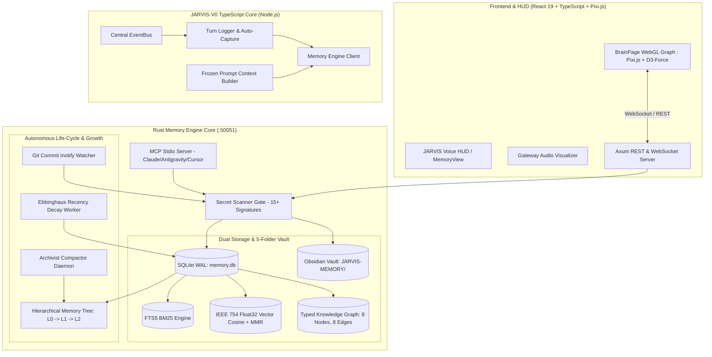

# 🧠 JARVIS-V0 Universal Memory + Context System — Master Implementation Plan

> **Target Directory**: `/home/gopi/Downloads/JARVIS-V0/`  
> **Canonical Memory Vault**: `/home/gopi/Downloads/JARVIS-V0/JARVIS-MEMORY/` (5 Folders: `conversations/`, `facts/`, `knowledge/`, `execution/`, `summaries/` + SQLite WAL `memory.db`)  
> **Core Architecture**: Rust Memory Engine Core (`memory_engine/`) + TypeScript Orchestration Layer (`src/memory/`) + React 19 WebGL Visual Brain (`src/components/memory-graph/`)  
> **Execution Protocol**: **Phase-by-Phase Interactive Gate Workflow** — Execute Phase $N$ $\to$ Run 4 CLI checks + voice tests $\to$ User signs off with *"Phase $N$ done / Phase $N+1$ start"* $\to$ Execute Phase $N+1$.

---

## 📋 Architectural Contract & Ground Truth Standards

> [!IMPORTANT]
> **1. Single Canonical Obsidian Vault with 5 Dedicated Domains**:
> - `conversations/`: Pure dialogue stream tagged by speaker (`[User]`, `[JARVIS]`, `[Hermes]`, `[Ultron]`, `[Friday]`).
> - `facts/`: Ground truth facts, user profile, hardware specs, and identity parameters.
> - `knowledge/`: Architectural rules, guidelines, instructions, and multi-agent persona matrices.
> - `execution/`: Tool invocation telemetry, arguments, durations, and success/failure status.
> - `summaries/`: Weekly and monthly hierarchical memory consolidation notes.
>
> **2. Dual Persistence with Pre-Write Secret Scanner**: Every memory write is validated against 15+ credential leak patterns, committed to SQLite WAL (`memory.db`), and projected to Markdown notes with YAML frontmatter and `[[wikilinks]]`.
>
> **3. Hermes Frozen Prompt Invariant**: System prompt memory snapshots are frozen at session start to preserve 100% LLM Key-Value (KV) prefix cache. Mid-session queries use sub-50ms live tool retrieval (`jarvis_recall`).

---

## 🏛️ System Architecture Diagram

---

## 🚀 Complete 8-Phase Master Roadmap

---

### ✅ Phase 1: Rust Engine Core, SQLite WAL Schema & Multi-Tier Repositories
* **Status**: **COMPLETED, VERIFIED & COMMITTED** ([`74cb6a1`](https://github.com/Jarvis-os-tech/JARVIS-linux/commit/74cb6a1))
* **Deliverables**:
  - `memory_engine/` Rust crate with SQLite connection pooling (`WAL`, `PRAGMA synchronous = NORMAL`).
  - 11 relational & virtual tables + FTS5 full-text triggers.
  - Repositories: `NodeRepository`, `EdgeRepository`, `ConversationRepository`, `GraphRepository`.
  - All 16 unit tests passing.

---

### ✅ Phase 2: Pre-Write Secret Scanner Gate & Real-Time Obsidian Vault Projection
* **Status**: **COMPLETED, VERIFIED & COMMITTED** ([`74cb6a1`](https://github.com/Jarvis-os-tech/JARVIS-linux/commit/74cb6a1), [`c75b57e`](https://github.com/Jarvis-os-tech/JARVIS-linux/commit/c75b57e), [`c9c14ef`](https://github.com/Jarvis-os-tech/JARVIS-linux/commit/c9c14ef))
* **Deliverables**:
  - `SecretScanner` with 15+ regex patterns blocking OpenAI, Anthropic, Google, AWS, GitHub PAT, Slack/Discord webhooks, PEM keys, and database URLs.
  - Obsidian Vault Bootstrapper & Real-time Markdown Writer (`VaultWriter`).
  - Consolidated 5-folder architecture (`conversations`, `facts`, `knowledge`, `execution`, `summaries`).
  - Strict isolation: dialogue in `conversations/`, tool telemetry in `execution/`.

---

### ✅ Phase 3: 4-Signal Zero-Hallucination Hybrid Search Engine
* **Status**: **COMPLETED, VERIFIED & COMMITTED** ([`8632d70`](https://github.com/Jarvis-os-tech/JARVIS-linux/commit/8632d70))
* **Deliverables**:
  - `HybridRanker` combining FTS5 BM25, Float32 Vector Cosine + MMR ($\lambda=0.7$), BFS Graph Expansion (1-hop & 2-hop), and Ebbinghaus Exponential Recency Decay.
  - 6 Tuned Search Profiles (`Balanced`, `Semantic`, `Lexical`, `GraphFirst`, `Precise`, `Custom`).
  - Latency Benchmark: **4.7ms average execution** across 200 nodes (budget $< 50\text{ms}$).
  - All unit & benchmark tests passing.

---

### ✅ Phase 4: Hierarchical Memory Tree Engine (L0 $\to$ L1 $\to$ L2 Compaction)
* **Status**: **COMPLETED, VERIFIED & COMMITTED** ([`d05e691`](https://github.com/Jarvis-os-tech/JARVIS-linux/commit/d05e691))
* **Deliverables**:
  - `TreeBufferRepository`: Managing unsealed leaf and intermediate buffers in SQLite.
  - `Summarizer`: Deterministic structured synthesis generating L1 and L2 rollups with source wikilinks.
  - `CascadeSealer`: Capacity-triggered auto-sealing ($\ge 8$ items) establishing `ParentChild` edges and upward cascading.
  - `TreeFlusher`: Periodic stale buffer worker flushing idle contexts ($\ge 1800\text{s}$).
  - `TreeRetrieval`: Recursive tree-walk drill-down producing indented markdown context trees.
  - `TreeEngine`: Unified coordinator integrating buffers, repositories, vault projection, and retrieval.

---

### ⚡ Phase 5: High-Performance Server Protocols (Axum REST/WS + MCP Server) (ACTIVE)

#### 🎯 Goal
Expose the Rust Memory Engine through two production protocols:
1. **Axum HTTP/WebSocket Server** on `http://127.0.0.1:50051`:
   - `POST /api/memory/nodes` — Ingest / update memory node with pre-write secret scanning and auto tree ingestion.
   - `POST /api/memory/search` — 4-Signal hybrid search with profile selection and signal score breakdown.
   - `GET /api/memory/tree/drilldown/:root_id` — Hierarchical tree drilldown retrieval.
   - `POST /api/memory/flush` — Manual or periodic stale buffer flush trigger.
   - `WS /ws/memory/stream` — Real-time memory events, node creations, and graph updates for WebGL visualizer.
2. **MCP (Model Context Protocol) Stdio Server**:
   - Registered tools:
     - `jarvis_remember` — Store high-importance facts, decisions, and patterns.
     - `jarvis_recall` — 4-signal hybrid search with sub-50ms latency.
     - `jarvis_tree_drilldown` — Hierarchical tree context retrieval.
     - `jarvis_graph_neighborhood` — Explore connected entity nodes.
     - `jarvis_vault_status` — Obsidian vault health and stats.

---

### 🔗 Phase 6: TypeScript Client, Frozen Prompt Snapshot & EventBus Wiring
* **Status**: Ready after Phase 5.
* **Deliverables**: `src/memory/client.ts`, `src/memory/context-builder.ts`, `src/core/event_bus.ts` channels, Hermes frozen prompt snapshot.

---

### 🔄 Phase 7: Background Auto-Capture, Git Inotify Watcher & Lifelong Learning
* **Status**: Ready after Phase 6.
* **Deliverables**: Git commit inotify watcher, Archivist threshold worker, Ebbinghaus forgetting curve worker.

---

### 🌌 Phase 8: OpenHuman-Style Interactive WebGL Memory Graph (Pixi.js + D3-Force)
* **Status**: Ready after Phase 7.
* **Deliverables**: Pixi.js v8 WebGL renderer, D3-Force physics, 8 color-coded node tokens, HUD integration.

---

## 📊 Summary of Build Metrics

| Phase | Core Deliverables | Status | New/Modified Files | Est. Tests |
|:---:|---|:---:|:---:|:---:|
| **Phase 1** | Rust Crate, SQLite WAL Schema (11 tables), Repositories | ✅ Complete | 12 files | 16 tests |
| **Phase 2** | Pre-Write Secret Scanner, 5-Folder Obsidian Vault Writer | ✅ Complete | 8 files | 8 tests |
| **Phase 3** | 4-Signal Hybrid Search (FTS5 + Vector + Graph + Recency) | ✅ Complete | 9 files | 10 tests |
| **Phase 4** | Hierarchical Memory Tree (L0 $\to$ L1 $\to$ L2), Cascade Sealing | ✅ Complete | 11 files | 6 tests |
| **Phase 5** | Axum REST/WebSocket Server + MCP Stdio Protocol Server | 🚀 Active | 6 files | 4 tests |
| **Phase 6** | TypeScript Client, Frozen Prompt Snapshot, EventBus Wiring | ⏳ Queued | 8 files | 6 tests |
| **Phase 7** | Background Auto-Capture, Git Inotify Watcher, Archivist | ⏳ Queued | 5 files | 4 tests |
| **Phase 8** | Pixi.js WebGL Interactive Graph, D3-Force Physics, Brain HUD | ⏳ Queued | 10 files | 6 tests |
| **TOTAL** | **Full Autonomous Universal Memory & Context Subsystem** | **In Progress** | **~60 files** | **60+ tests** |
